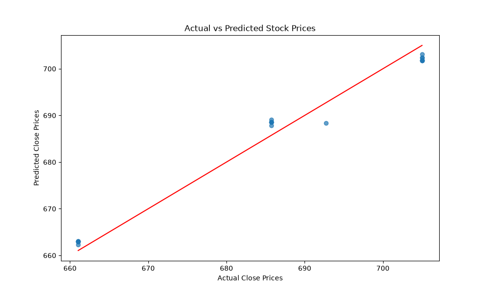
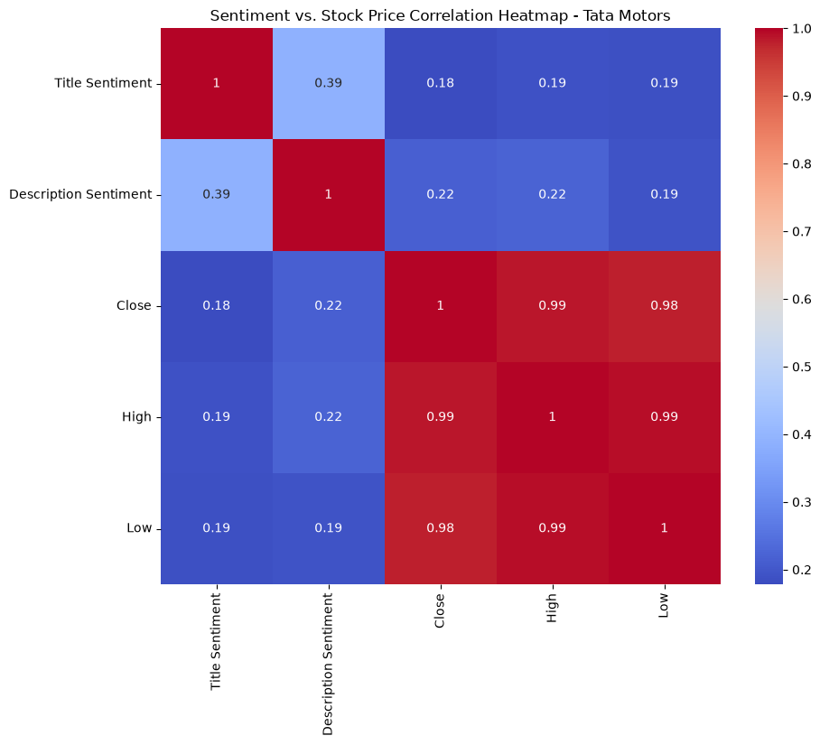
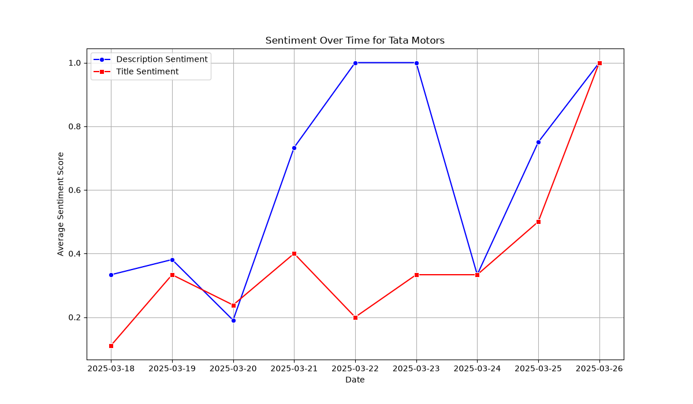

# Tata Motors Stock Price Prediction

Predicting Tata Motors stock prices using news sentiment and linear regression. This project was done as part of my research and written up as a preprint on TechRxiv.

**Paper:** [Stock Price Prediction for Tata Motors Using News Sentiment and Linear Regression](https://www.techrxiv.org/doi/full/10.36227/techrxiv.175423908.89189368) — TechRxiv, August 2025

---

## What it does

- Scrapes Tata Motors news articles using NewsAPI
- Cleans and analyses sentiment from headlines and descriptions
- Merges sentiment scores with historical stock price data from yFinance
- Trains a Linear Regression model to predict the next closing price

---

## Results

| Metric | Value |
|--------|-------|
| MAE | 2.57 |
| MSE | 7.12 |
| R² | 0.977 |

## Visualizations






---

## How to run

```bash
pip install -r requirements.txt
python data_cleaning.py
python sentiment_analysis.py
python linear_regression.py
```

Set your NewsAPI key as an environment variable before running:
```bash
export NEWS_API_KEY=your_key_here
```

---

## Stack
Python, scikit-learn, TextBlob, yFinance, NewsAPI, pandas, matplotlib, seaborn

---

**V2 of this project uses a Bidirectional LSTM trained purely on historical price data — no sentiment.**
